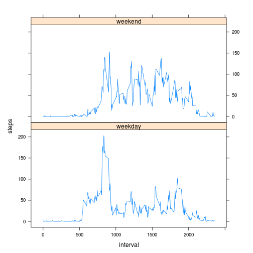

# Reproducible Research: Peer Assessment 1

## Loading and preprocessing the data


```r
dd <- read.csv("activity.csv", colClasses=c("integer","Date","integer"))
```

## What is mean total number of steps taken per day?

- Make a histogram of the total number of steps taken each day


```r
tot_steps <- tapply(dd$steps, dd$date, sum)
hist(tot_steps, breaks=15, xlab="steps/day")
```

 

- Calculate and report the **mean** and **median** total number of steps taken per day


```r
mean(tot_steps, na.rm=T)
```

```
## [1] 10766
```

```r
median(tot_steps, na.rm=T)
```

```
## [1] 10765
```

## What is the average daily activity pattern?

- Make a time series plot (i.e. type = "l") of the 5-minute interval (x-axis) and the average number of steps taken, averaged across all days (y-axis)


```r
steps_mean <- tapply(dd$steps, dd$interval, mean, na.rm=T)
num_interval <- as.numeric(dimnames(steps_mean)[[1]])
plot(num_interval, steps_mean, type="l", xlab="interval(5 min)", ylab="avg.steps")
```

 

- Which 5-minute interval, on average across all the days in the dataset, contains the maximum number of steps?


```r
num_interval[which(steps_mean==max(steps_mean))]
```

```
## [1] 835
```

## Imputing missing values

- Calculate and report the total number of missing values in the dataset (i.e. the total number of rows with NAs)


```r
sum(is.na(dd))
```

```
## [1] 2304
```

- Create a new dataset that is equal to the original dataset but with the missing data filled in.


```r
ddf <- dd
ddf[which(is.na(dd$steps)),]$steps <- 0
```

- Make a histogram of the total number of steps taken each day and Calculate and report the mean and median total number of steps taken per day. 


```r
fsteps <- tapply(ddf$steps, ddf$date, sum)
hist(fsteps, breaks=15, xlab="steps/day")
```

 

## Are there differences in activity patterns between weekdays and weekends?

- Create a new factor variable in the dataset with two levels – “weekday” and “weekend” indicating whether a given date is a weekday or weekend day.


```r
ddf$day = ifelse(as.POSIXlt(ddf$date)$wday%%6 == 0, "weekend", "weekday")
ddf$day = factor(ddf$day, levels = c("weekday", "weekend"))
```

- Make a panel plot containing a time series plot (i.e. type = "l") of the 5-minute interval (x-axis) and the average number of steps taken, averaged across all weekday days or weekend days (y-axis). The plot should look something like the following, which was creating using simulated data:

```r
sti = aggregate(steps ~ interval + day, ddf, mean)
library(lattice)
xyplot(steps ~ interval | factor(day), data = sti, aspect = 1/2, 
    type = "l")
```

 
